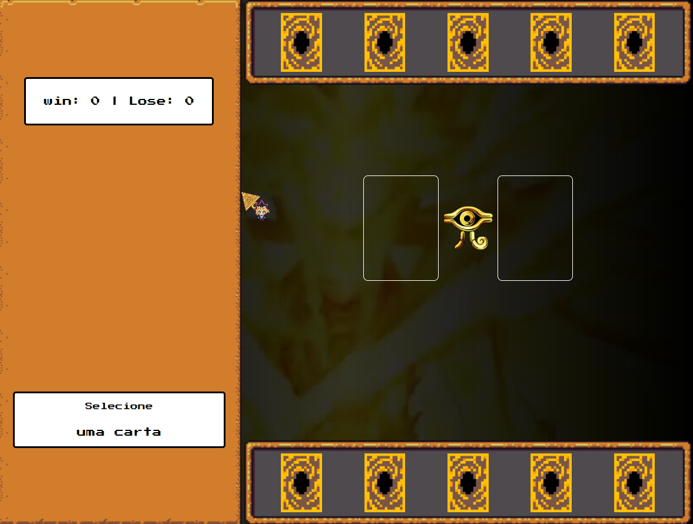

# Yu-Gi-Oh! - Jo-Ken-Po
> Desafio DIO - Criando um Jogo de cartas do Yu-Gi-Oh no estilo JokenPo utilizando JavaScript/CSS

## 📋 Índice
- [Link do projeto:](https://finandolopes.github.io/Yu_Gi_Oh/)

- [📖 Sobre](#-Sobre)
- [🚀 Tecnologias utilizadas](#-Tecnologias-utilizadas)
- [🖥 Preview](#-Preview)
- [📌 Créditos](#-Créditos)

## 📖 Sobre
Projeto desenvolvido durante o Bootcamp [Potência Tech iFood - Desenvolvimento de Jogos](https://web.dio.me/track/potencia-tech-ifood-desenvolvimento-de-jogos) Este desafio consiste em criar um jogo de cartas no estilo JokenPo, inspirando-se no Anime Yu-Gi-Oh.

## 🚀 Tecnologias utilizadas
- Javascript - HTML - CSS

## 🖥 Preview:

  

   

